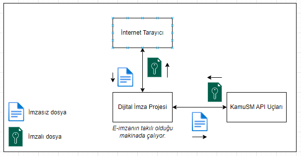
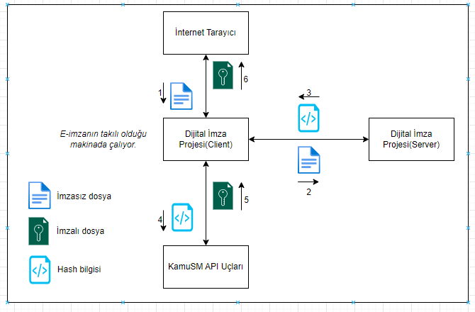
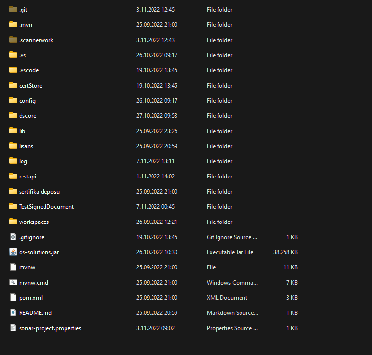
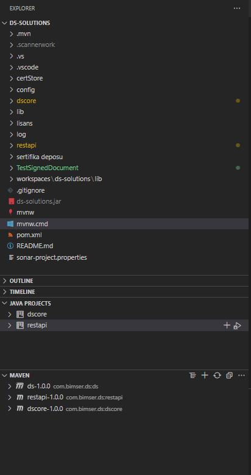
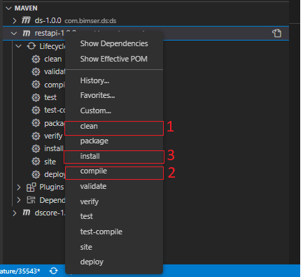

# KamuSM Api 

**Proje içerisindeki ana işlemler; **
* Giriş
* Neden Java?
* Proje Nasıl derlenir.
* Akıllı Kart İşlemleri 
    - Sertifika Bilgisi Okuma
        - Akıllı Kart Bilgilerini Alma
        - Sertifika Bilgisi Alma
* İmza Atma İşlemleri
    - Birinci Tip imza Atma (Direkt olarak dosya imzalama)
    - İkinci Tip İmza Atma (Dosyanın Hash bilgisini imzalama)
* Cades İmza Atma
    - Tümleşik imza
    - Ayrık imza
    - Seri imza
    - Paralel imza
* Cades İmza Doğrulama
* Pades  İmza atma
    - Tümlesik İmza
* Pades İmza Doğrulama
* Xades İmza Atma
    - Tümleşik imza
    - Ayrık imza
    - Seri imza
    - Paralel imza
    - Zarflanmış İmza
* Xades İmza Doğrulama
* İmza arşivleme
* İmza yükseltme
* Gelişmiş İmza Doğrulama
* Test İşlemleri
    - İmza Atma Testi
        - Tümleşik imza
        - Ayrık imza
        - Seri imza
        - Paralel imza
    - İmza Doğrulama Testi
    - İmzalanmış Belgenin Doğrulanması
    - İmza Upgrade Testleri
* Olası Hatalar
* Gelecek Geliştirmeler
* Desteklenen/Desteklenmeyen Dosya Türleri ve İmza Tipleri
* Nasıl Katkı Sağlayabilirsiniz
  


## Giriş
Dijital Signature projesi e-imza ile gerçekleştrimek istedikleriniz işlemleri temel anlamda karşılayan bir projedir. Projeyi çıkartma nedenlerimizden birisi de ülkemizdeki e-imza kullanmına ait dokuman, uygulama ve bilgi yetersizliğini biraz da olsa giderebilmekti. Bu bağlamda geliştirdiğimiz projenin kaynak kodlarını, gerekli açıklamalarını, projenin nasıl çalıştığını, hangi imza tiplerine destek verdiğini, projenin geliştirilebilir alanlarını ve bizim gelecek geliştirmelerimizin neler olduğunu ayrıntılı şekilde bu dökümandan öğrenebilirsiniz.

Dijital Signature projesi elektronik imza özelliği sağlayan bir projedir.Tübitak' ın geliştirdiği E-imza sisteminin Api uçlarını kullanarak **PDF(Pades)**, **XML(Xades)** ve tüm formatlar için geçerli olan **Cades** belge türleri için imzalama, imza doğrulama ve imza yükseltme işlemlerini gerçekleştirmektedir. Dijital Signature projesi sizin için kullanıma hazır bir kütüphanedir ve projeyi derlediğinizde imzalama işlemlerinizi kolaylıkla gerçekleştirebilirisiniz. Ayrıca Dijital Signature projesi geniş bir alternatif yapıya sahiptir. Projeyi entegre ettikten sonra imzalama işlemlerini sunucularınızda gerçekleştirebilir yüksek düzeyde veri güvenliği sağlayabilirsiniz.


Digital Signature projesi şuan için **BES-EST-ESXLONG ve ESA** imza türlerinde işlem yapabilmektedir.

Çalışma yapısı olarak, İnternet tarayıcınızdan gönderdiğiniz komut ile Bilgisayarınızda takılı olan USB Dungle(e-imza)' dan gerekli bilgileri çekerek imza atma işlemi gerçekleştirmedir. Aşağıdaki görselde bu ayrıntılı bir biçimde gösterilmiştir.

**Şekil1- 1. Tip İmza Atma**




**Şekil2- 2. Tip İmza Atma**



## Neden Java

Yukarıda' da belirttiğimiz üzere Digital Signature projesi Cades, Pades ve Xades formatları desteklemektedir. Bu formatlardan Pades tip (Pdf belgeleri imzalamak için kullanılır.) altyapısında iText pdf işleme kütüphanesi kullanmaktadır.  Proje 
bağımlılıkları için iText kütüphanesini ayrıca temin etmek gerekir. Fakat iText kütüphanesi .NET platformlarda Lisans gerektirmektedir. Bu sebeple "Tübitak' ın geliştirdiği E-imza" .NET kütüphanesi içerisinde Pades imza atma mevcut değildir.Kısaca iText kütüphanesi Java platformlarda lisans istememektedir. "Tübitak' ın geliştirdiği E-imza" Java kütüphanesinde de Pades imza mevcuttur. Bu sebeple Java projesi geliştirilmiştir.

## Proje Nasıl derlenir.

Github' dan indirdiğiniz bu projeyi çalıştırmak için bilgisayarınızda Java' yı Compile edebilecek bir uygulama, jdk yüklü olması gerelidir. Proje Maven olarak geliştirilmiş ve içerisinde SpringBoot kullanılmıştır. Bu sayede ekstre işlemlere gerek kalmadan derleme işlemleri basit bir şekilde yapılabilir.


>Dijital Signature projesi dosya yapısı aşağıdaki şekildedir.



>Projeyi Visual Studio Code' de açtığımız da karşımıza şu şekilde bir yapı çıkmaktadır.



> Açılan VS code projesinde Maven altında bulunan **dscore-1.0.0** ve **restapi-1.0.0** projelerine sırası ile **clean** **install** ve **compile** yapılmalıdır.



bu işlemlerden sonra projemizi Run edebilir.


## Akıllı Kart İşlemleri 

### Sertifika Bilgisi Okuma

Sertifika bilgisini okumak için öncelikle bilgisayara takılı olan akıllı kart listesini almak gereklidir. Akıllı Kart listesini almak için **"SmartCardController"** sınıfının **"getTerminals"**  metoduna **GET** isteği atılır.

#### **Akıllı Kart Bilgilerini Alma**

```sh
http://localhost:3638/api/smartcard/getTerminals
```

**Get isteğinden geri dönen cevap; **
Geri dönen cevaplar Base64 formatında gelmektedir.

```sh
[
    {
        "terminal": "QUNTIEFDUjM5VSBJQ0MgUmVhZGVyIDA=",
        "library": "YWtpc3AxMQ==",
        "slotId": "MQ=="
    }
]
```

Dönen değerler aşağıdaki tabloda açıklanmıştır.

| Özellik      | Açıklama                         | Değer (base64)                     | Değer (string)          |
|--------------|----------------------------------|------------------------------------|-------------------------|
| terminal     | Takılı akıllı kartın ismidir.    | "QUNTIEFDUjM5VSBJQ0MgUmVhZGVyIDA=" | ACS ACR39U ICC Reader 0 |
| library      | Kart Tipi                        | YWtpc3AxMQ==                       | akisp11                 |
| slotId Drive | Takılı olan kartı portId bilgisi | MQ==                               | 1                       |

> **Library** ve **SlotId** bilgisi akıllı karttan **Sertifika okumak** ve **imza atmak** için gerekli  bilgilerdir.

#### **Sertifika Bilgisi Alma**

Sertifika bilgilerini çekmek için **"SmartCardController"** sınıfının **"getCertificates"**  metoduna **POST** isteği atılır. Post isteğinde gönderilecek bilgiler aşağıdaki örnekte gösterilmiştir.

**İstek Adresi**

```sh
http://localhost:3638/api/smartcard/getCertificates
```

**İstek İçeriği** 

> İstekdeki library ve slotId bilgisi getTerminals metodundan dönen değerlerdir.

```sh
{
    "library": "YWtpc3AxMQ==", 
    "slotId": "MQ==",
    "onlyQualifiedCertificates": true
}
```

**Cevap Bilgisi** 

> Dönen değerler gizlilik için maskelenmiştir.

```sh
[
    {
        "certificateHex": "3e43500069001000730028663687474703a...",
        "subjectSerialNumber": "NDA2...",
        "serialNumber": "MzM...",
        "commonName": "Q049RVJPTCBF...",
        "isExpired": "Zm...",
        "issuer": "Q049VMOcUktUUlVTJ...",
        "issuerCommonName": "VMOcUktU...",
        "notAfter": "MjAyMy...",
        "notBefore": "MjAyM...",
        "subjectCommonName": "RVJP...",
        "subject": "Q049RVJ..."
    }
]
```

> Bu bilgilerden **certificateHex**, **serialNumber** bilgisi imza atma işleminde kullanacaktır.

| Özellik             | Açıklama                                |
|---------------------|-----------------------------------------|
| certificateHex      | Certifikanın hex formattaki bilgisidir. |
| subjectSerialNumber | Kart Tipi                               |
| serialNumber        | TC Kimlik Numarası                      |
| commonName          | Konum, AdSoyad ve SeriNumara bilgisi    |
| isExpired           | Geçerlilik Durumu                       |
| issuer              | Üretici Bilgisi                         |
| issuerCommonName    | Üretici Bilgisi                         |
| notAfter            | Sertifika Geçerlik Süresi bitiş tarihi  |
| notBefore           | Sertifika Alış Tarihi                   |
| subjectCommonName   | Sertifikat Sahibi Ad Soyad Bilgisi      |
| subject             | Takılı olan kartı portId bilgisi        |

## İmza Atma İşlemleri

İmza atmak için KamuSM - Digital Signature projesinde 2 farklı yol vardır. Bunlardan birisi direkt olarak dosya bilgisini göndererek imzalama diğeri ise imzalayacağımız dosyanın hash bilgisini oluşturarak imzalamadır.(Bu yöntem toplanda 3 farklı işlemden oluşmaktadır.)

> Bütün türler (Cades-Xades-Pades) için iki farklı imzalama özelliğide kullanılabilir.

### **Birinci Tip İmza Atma**

    Birinci tip imza atmak için CadesController, XadesController, PadesControllerları içerisinde bulunan **sign** metotduna istek atmak yeterli olacatır.
    

**İstek Adresi**

> Hangi türde imza atmak isteniyorsa o adrese istek atılmalıdır.

```sh
Birinci Tip İmza Atma
http://localhost:3638/api/cades/sign
http://localhost:3638/api/xades/sign
http://localhost:3638/api/pades/sign
```

**İstek İçeriği** 

> İstekdeki **library** ve **slotId** bilgisi **getTerminals** metodundan dönen değerlerdir.

İstekdeki **certificateHex** ve **certificateSerialNumber** bilgisi **getCertificates** metodundan dönen değerlerdir.

```sh
{
    "certificateHex": "3e43500069001000730028663687474703a",
    "file": "MIKyYQYJKoZIhvcNAQc...",
    "embeddedSignature": true,
    "isCounter": true,
    "signatureType": 2,
    "timeStampHost": "timeStampHost",
    "timeStampUser": "timeStampUser",
    "timeStampPassword": "timeStampPass",
    "library": "YWtpc3AxMQ",
    "slotId": "MQ==",
    "certificateSerialNumber": "MzM...",
    "pin": "123456"
}
```

| Özellik                 | Açıklama                                |
|-------------------------|-----------------------------------------|
| certificateHex          | Certifikanın hex formattaki bilgisidir. |
| file                    | base64 formatındaki imzalanacak dosya   |
| embeddedSignature       | Tümleşik veya Ayrık İmza olma bilgisi   |
| isCounter               | Seri ve Paralel imza olma bilgisi       |
| signatureType           | imza tipi (Bes-Est-Esxlong-Esa)         |
| timeStampHost           | Zaman damgası host adresi               |
| timeStampUser           | Zaman damgası kullanıcı adı             |
| timeStampPassword       | Zaman damgası parola                    |
| library                 | Akıllı kartın kütüphane bilgisi         |
| slotId                  | Akıllı kartın slot(port) bilgisi        |
| certificateSerialNumber | Sertifika Seri Numarı                   |
| pin                     | Akıllı kart parola bilgisi              |

**Cevap Bilgisi** 

> Birinci ve İkinci tip imzalamalarda dönen format aynıdır.

```sh
base64 formatta imzalanmış döküman dönmektedir.
```

### **İkinci Tip İmza Atma**

İkinci Tip İmza atma dosyanın hash bilgisinin oluşturulup imzacıya gönderilmesiyle yapılan imzalamadır. Bir dosya imzalanırken dosya ve imzacı her zaman aynı yerde çalışmayabilir. Bu sebeple dosyanın tamamını imzacıya göndermek yerine dosyanın hash bilgisi göndermek veri boyutu açısından daha verimli olacaktır. Bu ihtiyacı karşılamak için ikinci tip imza atma metodu geliştirilmiştir.

* InitializeSigning
* Sign
* FinalizeSigning

**InitializeSigning**

> Hangi türde imza atmak isteniyorsa o adrese istek atılmalıdır.

**İstek Adresi**

```sh
İkinci Tip İmza Atma
http://localhost:3638/api/cades/initializeSigning
http://localhost:3638/api/xades/initializeSigning
http://localhost:3638/api/pades/initializeSigning
```

**İstek İçeriği** 

```sh
{
    "key": "test-123",
    "certificateHex": "{{certificate}}",
    "file": "dGVzdCBkb2vDvG1hbiBkZW5lbWUgaW16YQ==",
    "existSignature": "dGVzdCBkb2vDvG1hbiBkZW5lbWUgaW16YQ==",
    "embeddedSignature": true,
    "signatureType": 0,
    "isCounter": true,
    "timeStampHost": "timeStampHost",
    "timeStampUser": "timeStampUser",
    "timeStampPassword": "timeStampPass"
}
```

| Özellik           | Açıklama                                                                |
|-------------------|-------------------------------------------------------------------------|
| key               | ...........                                                             |
| certificateHex    | Certifikanın hex formattaki bilgisidir.                                 |
| file              | base64 formatındaki imzalanacak dosya                                   |
| existSignature    | Daha önceden imzalanmış dosyanın base64 formatındaki ayrık imza bilgisi |
| embeddedSignature | Tümleşik veya Ayrık İmza olma bilgisi                                   |
| isCounter         | Seri ve Paralel imza olma bilgisi                                       |
| signatureType     | imza tipi (Bes-Est-Esxlong-Esa)                                         |
| timeStampHost     | Zaman damgası host adresi                                               |
| timeStampUser     | Zaman damgası kullanıcı adı                                             |
| timeStampPassword | Zaman damgası Parola                                                    |

**Cevap Bilgisi** 

```sh
{
    "digestToBeSigned": "/w9slx2VTf2oq36fFcJDW4ny/vae0I2v0gG5f1V8ze/++mMw4AD",
    "transactionUUID": "63D1770A9143729C62962FC5599D0609D709343D5E299D8E71"
}
```

| Özellik          | Açıklama                                    |
|------------------|---------------------------------------------|
| digestToBeSigned | Hash bilgisi                                |
| transactionUUID  | Initialize(başlatılan) işlemin UUID bilgisi |

**Sign**

> Başlattığımız (Initialize) isteğimizi imzalıyoruz.

**İstek Adresi**

```sh
http://localhost:3638/api/smartcard/sign
```

**İstek İçeriği** 

```sh
{
    "data": "/w9slx2VTf2oq36fFcJDW4ny/vae0I2v0gG5f1V8ze/++mMw4AD",
    "library": "YWtpc3AxMQ",
    "slotId": "MQ==",
    "certificateSerialNumber": "MzM...",
    "pin": "123456"
}
```

| Özellik | Açıklama                                                    |
|---------|-------------------------------------------------------------|
| data    | InitializeSigning metodundan dönen digestToBeSigned bilgisi |
| library | Kartı Tipi                                                  |
| slotId  | Takılı olan kartı portId bilgisi                            |
| pin     | Akıllı kart şifresi                                         |

**Cevap Bilgisi**

```sh
{
    "signedData" = "Q5eaPK/4RPUhDJlzioDsNo6SxFojpBRe9ivC+Ss0rVI"
}
```

| Özellik    | Açıklama                                              |
|------------|-------------------------------------------------------|
| signedData | base64 formatta imzalanmış dökümanın Hash bilgisidir. |

**FinalizeSigning**

**İstek Adresi**

```sh
http://localhost:3638/api/sign/finalizeSigning
```

**İstek İçeriği**

```sh
{
    "key":"63D1770A9143729C62962FC5599D0609D709343D5E299D8E71",
    "signatureData":"Q5eaPK/4RPUhDJlzioDsNo6SxFojpBRe9ivC+Ss0rVI"
}
```

| Özellik       | Açıklama                                              |
|---------------|-------------------------------------------------------|
| key           | Initialize(başlatılan) işlemin UUID bilgisi           |
| signatureData | base64 formatta imzalanmış dökümanın Hash bilgisidir. |

**Cevap Bilgisi**

```sh
Base64 formatta İmzalanana Döküman 
"MIIK8wYJKoZIhvcNAQcCoIIK5DCCCuACAQExDTALBglghkgBZQMEAgMwKAYJKoZIhvcNAQcBoBsEGXRlc3QgZG9r"
```

## **Cades İmza Atma**

Cades imza tipi tüm döküman tiplerine (mp3, mp4, png, txt vb) atılan bir imza türüdür. Bu imza türünde Tümleşik, Ayrık, Seri ve Paralel imzalar atılabilir.

Yukarıda imza atma işlemlerinde gösterilen istekler bu yöntem için kullanılabilir. 

### **Tümleşik İmza**

Tümleşik imza imzalanan belge ve imza bilgisinin bir arada tutulduğu formattır. KamuSM - Digital Signature projesinde bu formatta imza atmak için imzalama isteğindeki **embeddedSignature** parametresi **true** olarak geçilmelidir.

### **Ayrık İmza**

Ayrık imza atmak için **embeddedSignature** parametresi **false** olarak geçilmelidir. 

### **Seri İmza**

 Seri imza, atılan bir imzanın imzalanmasıdır. İmzalanacak döküman da imza seviyelerini belirlemek için kullanılır.

> İlk imzada paralel ve seri seçeneğinin bir önemi yoktur fakat bir adet imza bulunan bir dökümana ikinci imza atılmak istendiğinde paralel ve seri seçeneği kullanılabilir. 

Seri imza atabilmek için **isCounter** parametresi **true** olarak geçilmelidir. 

### **Paralel İmza**

İmza seviyeleri eşit olan imzalama çeşidir. Bu yöntemde ikinci bir imza atılıyor ise birinci imza ile seviye olarak eşittir.

Seri imza atabilmek için **isCounter** parametresi **false** olarak geçilmelidir. 

## **Cades İmza Doğrulama**

Cades imza doğrulama yapmak için **CadesController**' ın **verify** metoduna istek atılır.

**İstek Adresi**

```sh
http://localhost:3638/api/cades/verify
```

**İstek İçeriği**

```sh
{
    "file":"63D1770A9143729C62962FC5599D0609D709343D5E299D8E71",
    "existSignature":"Q5eaPK/4RPUhDJlzioDsNo6SxFojpBRe9ivC+Ss0rVI"
}
```

| Özellik        | Açıklama                                                                |
|----------------|-------------------------------------------------------------------------|
| file           | İmzalı döküman veya ayrık olarak imzalanmış dökümanın imzalanmamış hali |
| existSignature | Ayrık olarak imzalanmış dökümanın imza bilgisi                          |

**Cevap Bilgisi**

```sh
Dosya imzalı ise True, imzalı değil ise False olarak dönüş yapar.
true / false
```

> Tümleşik olarak imzalanmış dosyalarda sadece **file** bilgisi göndermek yeterli olacaktır.
> Ayrık olarak immzalanmış dosyalarda ise dosyanın kendisi ve imza bilgileri ile istek atmak gereklidir.

## **Pades İmza Atma**

### **Tümleşik İmza**

Tümleşik imza imzalanan belge ve imza bilgisinin bir arada tutulduğu formattır. KamuSM - Digital Signature projesinde bu formatta imza atmak için imzalama isteğindeki **embeddedSignature** parametresi **true** olarak geçilmelidir.

> Pades imzalamada **Seri imza, Paralel imza ve Ayrık imza** seçenekleri yoktur.

## **Pades İmza Doğrulama**

Pades imza doğrulama yapmak için **PadesController**' ın **verify** metoduna istek atılır.

**İstek Adresi**

```sh
http://localhost:3638/api/pades/verify
```

**İstek İçeriği**

```sh
{
    "file":"63D1770A9143729C62962FC5599D0609D709343D5E299D8E71",
}
```

| Özellik | Açıklama       |
|---------|----------------|
| file    | İmzalı döküman |

**Cevap Bilgisi**

```sh
Dosya imzalı ise True, imzalı değil ise False olarak dönüş yapar.
true / false
```

> Tümleşik olarak imzalanmış dosyalarda sadece **file** bilgisi göndermek yeterli olacaktır.
> Ayrıca Pades imza sadece Tümleşik olarak atıldığından existSignature bilgisi almamaktadır.

## **Xades İmza Atma**

### **Tümleşik İmza**

Tümleşik imza imzalanan belge ve imza bilgisinin bir arada tutulduğu formattır. KamuSM - Digital Signature projesinde bu formatta imza atmak için imzalama isteğindeki **embeddedSignature** parametresi **true** olarak geçilmelidir.

### **Ayrık İmza**

Ayrık imza atmak için **embeddedSignature** parametresi **false** olarak geçilmelidir. 

### **Seri İmza**

Seri imza atabilmek için **isCounter** parametresi **true** olarak geçilmelidir. 

### **Paralel İmza**

İmza seviyeleri eşit olan imzalama çeşidir. Bu yöntemde ikinci bir imza atılıyor ise birince imza ise seviye olarak eşittir.

### **Zarflanmış İmza**

XML verisi, içinde imzayı barındırır. Bu tür de imza atabilmek için **isEnveloped** parametresini **true** olarak geçmek gerekir.

> Xades imzada diğer imza türlerinden farklı  olarak **fileName** parametresi mevcuttur. Bu parametre ayrık imza oluşturulduğunda oluşan dosya içerisine yazılır ve **fileName** bilgisi kullanılarak doğrulama sırasında xml dosyası referans alınır.

## **Xades İmza Doğrulama**

Xades imza doğrulama yapmak için **XadesController**' ın **verify** metoduna istek atılır.

**İstek Adresi**

```sh
http://localhost:3638/api/xades/verify
```

**İstek İçeriği**

```sh
{
    "file":"63D1770A9143729C62962FC5599D0609D709343D5E299D8E71",
    "existSignature":"Q5eaPK/4RPUhDJlzioDsNo6SxFojpBRe9ivC+Ss0rVI",
    "fileName":"test"
}
```

| Özellik        | Açıklama                                                                |
|----------------|-------------------------------------------------------------------------|
| file           | İmzalı döküman veya ayrık olarak imzalanmış dökümanın imzalanmamış hali |
| existSignature | Ayrık olarak imzalanmış dökümanın imza bilgisi                          |
| fileName       | İmzalı dökümanın dosya adıdır.                                          |

**Cevap Bilgisi**

```sh
Dosya imzalı ise True, İmzalı değil ise False olarak dönüş yapar.
true / false
```

> Tümleşik olarak imzalanmış dosyalarda sadece **file** bilgisi göndermek yeterli olacaktır.
> Ayrık olarak immzalanmış dosyalarda ise dosyanın kendisi ve imza bilgileri ile istek atmak gereklidir.
> Ayrıca Xades imza için doğrulama yaparken **fileName** bilgisine ihtiyaç vardır.

## **İmza Arşivleme**

**İstek Adresi**

> Hangi türdeki dosyayı arşivlemek isteniyorsak o adrese istek atılmalıdır.

```sh
http://localhost:3638/api/cades/archive
http://localhost:3638/api/xades/archive
http://localhost:3638/api/pades/archive
```

**İstek İçeriği** 

```sh
{
    "file": "AgMC4wIDAuMCAwLjBdCj4+++CnN0YXJ0eHJlZgoxN...",
    "whiteList": [
        "SHA512"
    ],
    "timeStampHost": "timeStampHost",
    "timeStampUser": "timeStampUser",
    "timeStampPassword": "timeStampPass"
}
```

| Özellik           | Açıklama                      |
|-------------------|-------------------------------|
| file              | İmzalı döküman                |
| whiteList         | Secure Hash Algorithm bilgisi |
| timeStampHost     | Zaman damgası host adresi     |
| timeStampUser     | Zaman damgası kullanıcı adı   |
| timeStampPassword | Zaman damgası şifre bilgisi   |
| fileName          | İmzalı dosyanın adı           |


> Xades arşivleme yaparken bu parametrelere ek olarak **fileName** bilgisi gönderilmelidir.

## **İmza Yükseltme**


**İstek Adresi**

> Hangi türdeki dosyayı yükseltmek istiyorsak o adrese istek atılmalıdır.

```sh
http://localhost:3638/api/cades/upgradeSignature
http://localhost:3638/api/xades/upgradeSignature
http://localhost:3638/api/pades/upgradeSignature
```

**İstek İçeriği** 

```sh
{
    "file": "",
    "existSignature":"",
    "signatureType": 2,
    "timeStampHost": "timeStampHost",
    "timeStampUser": "timeStampUser",
    "timeStampPassword": "timeStampPass"
}
```

| Özellik           | Açıklama                                       |
|-------------------|------------------------------------------------|
| file              | İmzalı döküman                                 |
| existSignature    | Ayrık olarak imzalanmış dökümanın imza bilgisi |
| signatureType     | İmzayı yükseltmek istediğimiz seviye           |
| timeStampHost     | Zaman damgası host adresi                      |
| timeStampUser     | Zaman damgası kullanıcı adı                    |
| timeStampPassword | Zaman damgası şifre bilgisi                    |
| fileName          | İmzalı dosyanın adı                            |


> Xades imza yükseltme yaparken bu parametrelere ek olarak **fileName** bilgisi gönderilmelidir.


| Sayısal Değer | İmza Tipi |
|---------------|-----------|
| 0             | BES       |
| 1             | EST       |
| 2             | ESXLONG   |
| 3             | ESA       |

> Örnek istekde içeriğinde imza ESXLONG' a çevrilmek istenmiştir.

> Yükseltme isteği atarken hiyerarşik olarak sıralama dikkate alınmalıdır. Örneğin 2. seviye bir imza 1. seviyeye yükseltilemez. Fakat 3. seviyeye yükseltilebilir.

## **Gelişmiş İmza Doğrualama**

> Hangi türdeki dosyayı doğrulamak istiyorsak o adrese istek atılmalıdır.

```sh
http://localhost:3638/api/cades/verifyAndReturnSignatureInfos
http://localhost:3638/api/xades/verifyAndReturnSignatureInfos
http://localhost:3638/api/pades/verifyAndReturnSignatureInfos
```

**İstek Adresi**

```sh
http://localhost:3638/api/cades/verifyAndReturnSignatureInfos
```

**İstek İçeriği**

```sh
{
    "file":"63D1770A9143729C62962FC5599D0609D709343D5E299D8E71",
    "existSignature":"Q5eaPK/4RPUhDJlzioDsNo6SxFojpBRe9ivC+Ss0rVI"
}
```

| Özellik        | Açıklama                                                                |
|----------------|-------------------------------------------------------------------------|
| file           | İmzalı döküman veya ayrık olarak imzalanmış dökümanın imzalanmamış hali |
| existSignature | Ayrık olarak imzalanmış dökümanın imza bilgisi                          |

**Cevap Bilgisi**

```sh
{
    "signatures": [
        {
            "certificate": {
                "data": "Uw4f4PRdyg46GthksH+C5WAgp3kCoBbUzPA2cR7i1roSxq/KCfk2ch0aMJw=="
            },
            "signType": "TYPE_BES",
            "signOwner": "EROL ERYİĞİT",
            "signOwnerDescription": "CN=Ad Soyad,L=İL Bilgisi,C=TR,SERIALNUMBER=TCKN",
            "identifierNo": "40627698990",
            "contentType": null,
            "digestAlgorithm": "SHA512",
            "signatureAlgorithm": "[RSA-with-SHA512,null]",
            "policyOID": null,
            "signDate": "2022-11-06T21:45:31.000+00:00",
            "timeStamp": null,
            "archiveTimeStamps": null,
            "hasTimeStamp": false,
            "hasArchiveTimeStamps": false,
            "moneyLimit": "10000.0",
            "qCStatements": null,
            "isValid": true,
            "isQualified": true,
            "isSignatureValid": null,
            "isCounterSignature": false,
            "contentHint": null,
            "commitmentType": -1,
            "contentIdentifier": null,
            "signerLocation": null,
            "contentTimeStamp": null,
            "policyAddress": "",
            "contentReference": null,
            "requiresArchival": null
        }
    ],
    "timeStamp": null,
    "isValid": true,
    "validationDescription": "Imzali Veri icerisindeki tum imzalar dogrulandi.",
    "validationDetail": "1. Signature is checked. \nResults:\nSigner Certificate:CN=EROL ERYİĞİT,L=KOCAELİ,C=TR,SERIALNUMBER=40627698990\nPre-verification is done.\nSignature Checker Results:\n(+) Signature Checker\n\tSignature crypto verification is successful.\n(+) Message Digest Attribute Checker\n\tMessage digest check is successful.\n(+) Signing Certificate V2 Attribute Checker\n\tSigning certificate attribute check is successful.\n(+) Certificate Validation Checker\n\tCertificate validation is successful\n(+) Content Type Attribute Checker\n\tContent Type attribute check is successful.\n"
}
```

| Özellik              | Açıklama                                    |
|----------------------|---------------------------------------------|
| data                 | Sertifikanın hex formattaki bilgisi         |
| signType             | İmzalanmış dökümanın  tipi                  |
| signOwner            | İmzayan kişi Ad-Soyad                       |
| signOwnerDescription | AdSoyad, il, Ülke ve TCKN bilgisi           |
| identifierNo         | TCKN Bilgisi                                |
| contentType          | İçerik Türü                                 |
| digestAlgorithm      | digestAlgorithm türü                        |
| signatureAlgorithm   | signatureAlgorithm türü                     |
| policyOID            | Politika ID' si                             |
| signDate             | İmzalanma Tarihi                            |
| timeStamp            | Zaman Damgası Bilgisi                       |
| archiveTimeStamps    | Arşiv Zaman Damgası Bilgisi                 |
| hasTimeStamp         | Zaman Damgasına olup olmadığı bilgisi       |
| hasArchiveTimeStamps | Arşiv zaman Damgasına olup olmadığı bilgisi |
| moneyLimit           | Para Limiti                                 |
| qCStatements         | ...                                         |
| isValid              | İmza doğruluk bilgisi                       |
| isQualified          | Sertifika Nitelikli mi                      |
| isSignatureValid     | imza doğruluk bilgisi                       |
| isCounterSignature   | Seri imza bilgisi                           |
| contentHint          | İçeril ipucu                                |
| commitmentType       | ...                                         |
| contentIdentifier    | İçerik tanımlayıcı                          |
| signerLocation       | İmzacı Konumu                               |
| contentTimeStamp     | İçerik zaman damgasu                        |
| policyAddress        | Politika Adresi                             |
| contentReference     | İçerik referansı                            |
| requiresArchival     | Arşiv bilgisi                               |

## Olası Hatalar

Gelişmiş imza doğrulamadaki bazı parametrelerimizin KamuSM kütüphanesindeki karşılıklarını bulamadık. KamuSM ile yapmakta olduğumuz görüşmeler neticesinde bu eksik parametreleri geliştirmelerimize ekleyeceğiz.
Örneğin, signerLocation, contentReference gibi bilgiler şuan null olarak gelmektedir.


## Gelecek Geliştirmeler

Dijital Signature projesi Bimser Çözüm şirketi tarafından geliştirilmiş ve geliştirilmeye devam edeceketir. Geliştirme hedeflerimiz arasında Mobil Imza imza desteği ve Son kullanıcının kullanabileceği arayüze sahip bir imza uygulaması yer almaktadır.

### Mobil İmza Entegrasyonu

Mobil imza ientegrasyonu gelecek ilk geliştirmemiz olacak ve Turkcell, Turk Telekom, Vofadone operatorlerinden imzalama işlemleri yapılabilecektir.

### İmza Atma Arayüz Uygulaması

Arayüz uygulamamız ise geliştiriciler haricinde son kullanıcılarada hitap edecektir. Bu arayüz uygulaması üzerinden kullanıcılar imza atma, doğrulama ve yükseltme işlemlerini bir tık ile gerçekleştirebileceklerdir.

### Eksik Parametrelerin Tamamlanması
Detaylı İmza Doğrulama kısmında bazı parametrelerin karşılıklıkları null olarak gelmektedir. Bu parametrelerin KamuSM karşılıkları sağlandığında bu parametreler doldurulacaktır.

## Desteklenen/Desteklenmeyen Dosya Türleri ve İmza Tipleri

| Dosya Tipi | Dosya Formatı     | BES | EPES | EST | ESC | ESX_v1 | ESX_v2 | ESXLong | ESXLong_v1 | ESXLong_v2 | ESA | ESA_v2 |
|------------|-------------------|-----|------|-----|-----|--------|--------|---------|------------|------------|-----|--------|
| Pades      | pdf               | +   | +    | +   | -   | -      | -      | +       | -          | -          | +   | -      |
| Xades      | xml               | +   | +    | +   | -   | -      | -      | +       | -          | -          | +   | -      |
| Cades      | .*(tüm formatlar) | +   | +    | +   | -   | -      | -      | +       | -          | -          | +   | -      |

Temel sevidede desteklediğimiz türler imza işlemlerini gerçekleştirmek için ilk aşamada yeterli seviyededir. Bu tabloda yer alan desteklediğimiz türlerin açıklamaları şu şekildedir.

**BES**

Bes imza standart bir imzadır. Dökümanda sadece imza bilgisi barındırmaktadır.Sadece dokümanın kimin tarafından imzalandığı bilinmektedir.

**EST**

EST' yı ise BES' den ayıran özellik imzalama işleminde, imzanın ne zaman eklendiği bilgisinide eklenmesidir. Bu ne zaman imzalandığı bilgisine zaman damgası denmektedir.

**ESXLong**

ESXLong imza aynı zamanda bir EST imzadır. ESXLong imza, EST imzadan farklı olarak imza içerisinde sertifika doğrulamada kullanılacak doğrulama verisini içerir.

**ESA** 


ESA tipi imza, kriptografik algoritmaların zamanla güvenilirliğini kaybetmesine karşı geliştirilmiş bir imza türüdür. Şu anda güvenerek kullandığımız algoritmalar, 5-10 yıl sonra güvenilemez duruma gelebilir. Bu algoritmalar güvenilmez duruma geçmeden önce, imzaların ESA tipine çevrilmesi gerekmektedir. Yalnız imza atıldıktan hemen sonra imzanın ESA'ya çevrilmesi fazladan bir güvenlik sağlamaz. 

## Nasıl Katkı Sağlayabilirsiniz

Dijital Signature projesinin farklı amaçlarından bir taneside geliştrime yapmak isteyen kullanıcılara geliştirme alt yapısı sağlamasıdır. Proje' de kullanılan tüm kodlar tüm kullanıcıların istediği gibi şekillendirip kullanması için açık kaynak kodu ile paylaşılmıştır. Bu yönden kullanıcıların geliştirme olarak ilk ihtiyaçları aşağıdaki seçeneklerden olabilir.
  
  - Bizim temel anlamlda desteklediğimiz imza türlerinin üzerine KamuSM API' sinin desteklediği diğer türler olan **EPES**, **ESC**, **ESX_v1**,**ESX_v2**, **ESXLong_v1** **ESXLong_v1** ve **ESA_v2** türlerinin geliştirmesi,
  - İmza doğrulama aşamasında KamuSM API'sinden dönen tüm değerlerin kullanıcılara filtresiz olarak gösterilmesi,
  - İmza atma işleminden sonra atılan imzanın sağlık kontrolü (imza attıktan sonra imzayı bir de doğrulama işlemi),

gibi geliştirmeler yapılabilir.

